<div id="header" align="center">
  
</div>

<div id="badges" align="center">
  <a href="https://www.linkedin.com/in/darran-smith-559239a4/">
    
  </a>
  <a href="https://www.instagram.com/paperaceae/">
    
  </a>
  <a href="https://twitter.com/DarranS360">
    
  </a>
</div>

<div align="center">
    
</div>

---

## Hi there 

```python
about_me = input("Would you like to know about me?\n").lower()

if about_me in ("yes", "no", "maybe", "who are you", "¿quién eres?"):
    print("""
    I'll tell you anyway. Hi, I'm Darran.

    I'm a DevOps / Platform Engineer working across cloud infrastructure,
    container orchestration, and infrastructure-as-code. What started as
    a career change fuelled by a love of coding has turned into a full-time
    career building things that are automated, scalable, and (mostly)
    don't break at 3am.

    This GitHub is still very much a playground. A place to experiment,
    tinker, break things on purpose, and occasionally build something
    genuinely useful. Don't expect everything here to be production-grade.
    That's the point.
    """)
```

---

### :hammer_and_wrench: Languages & Tools

#### Cloud & Infrastructure
<div>
  &nbsp;
  &nbsp;
  &nbsp;
  &nbsp;
  &nbsp;
</div>

#### Languages & Frameworks
<div>
  &nbsp;
  &nbsp;
  &nbsp;
  &nbsp;
  &nbsp;
  &nbsp;
  &nbsp;
</div>

#### CI/CD & Tooling
<div>
  &nbsp;
  &nbsp;
  &nbsp;
  &nbsp;
</div>

<br />

| Category | Technologies |
|---|---|
| **Cloud** | AWS (EKS, ECR, IAM, VPC, Lambda, S3, Route 53, CloudTrail, Security Hub, DynamoDB, Cognito, API Gateway) |
| **IaC** | Terraform, AWS Control Tower / AFT |
| **Containers & Orchestration** | Kubernetes, Docker, Kaniko, Helm |
| **CI/CD** | GitLab CI/CD |
| **Security** | Checkov, Trivy, HashiCorp Vault |
| **Languages** | Python, Bash, JavaScript, HTML, CSS |
| **Frameworks** | FastAPI, React |

---

### :fire: My Stats

[](https://git.io/streak-stats)


 


---

### Currently Learning & Working Towards 🌱

- 📚 BSc Digital and Technology Solutions (Level 6 Degree Apprenticeship)
- ☸️ Certified Kubernetes Administrator (CKA)
- ☁️ AWS Solutions Architect Associate
  
---

### Hobbies and Interests :open_book::dragon::ramen:

- Pokémon card collecting
- Manga reader
- Sourdough baker
- Boardgames Tabletop RPGs
- 3D printing enthusiast (FDM and Resin)
- Plant nerd 
- Classical guitarist 
- Keen reader across all genres
